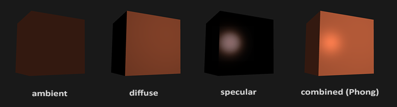
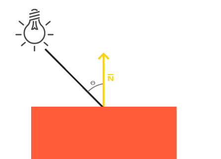

# Basic Lighting
现实世界的光照是极其复杂的，而且会受到诸多因素的影响，这是我们有限的计算能力所无法模拟的。因此OpenGL的光照使用的是简化的模型，对现实的情况进行近似，这样处理起来会更容易一些，而且看起来也差不多一样。这些光照模型都是基于我们对光的物理特性的理解。其中一个模型被称为冯氏光照模型(Phong Lighting Model)。冯氏光照模型的主要结构由3个分量组成：环境(Ambient)、漫反射(Diffuse)和镜面(Specular)光照。下面这张图展示了这些光照分量看起来的样子：



* 环境光：即使天黑了，世界上的某个地方通常仍然有一些光（月亮，远处的光）所以物体几乎永远不会完全黑暗。 为了模拟这一点，我们使用了一个环境照明常数，它总是给物体一些颜色。
* 漫反射照明：模拟光对象对对象的定向影响。 这是光照模型中视觉上最重要的组成部分。 物体的一部分越朝向光源，它变得越亮。
* 镜面照明：模拟出现在发光物体上的光的亮点。 镜面高光更倾向于光的颜色而不是物体的颜色。

## 环境光
光通常都不是来自于同一个光源，而是来自于我们周围分散的很多光源，即使它们可能并不是那么显而易见。光的一个属性是，它可以向很多方向发散并反弹，从而能够到达不是非常直接临近的点。所以，光能够在其它的表面上反射，对一个物体产生间接的影响。考虑到这种情况的算法叫做全局照明(Global Illumination)算法，但是这种算法既开销高昂又极其复杂。

由于我们不是复杂和昂贵算法的忠实拥护者，我们将从使用非常简单的全局照明模型开始，即环境光。 正如您在上一节中看到的那样，我们使用了一种小的常量（光照）颜色，我们将其添加到对象片段的最终结果颜色中，这样子的话即便场景中没有直接的光源也能看起来存在有一些发散的光。

向场景添加环境光非常容易。 我们采用光的颜色，将它乘以一个小的常量环境因子，将其乘以对象的颜色，并将其用作立方体对象着色器中的片段颜色：

glsl:
```glsl
void main()
{
    float ambientStrength = 0.1;
    vec3 ambient = ambientStrength * lightColor;

    vec3 result = ambient * objectColor;
    FragColor = vec4(result, 1.0);
}
```

## 漫反射光照

漫反射光照使物体上与光线方向越接近的片段能从光源处获得更多的亮度。 



图左上方有一个光源，它所发出的光线落在物体的一个片段上。我们需要测量这个光线是以什么角度接触到这个片段的。 如果光线垂直于物体表面，这束光对物体的影响会最大化（译注：更亮）。为了测量光线和片段的角度，我们使用一个叫做法向量(Normal Vector)的东西，它是垂直于片段表面的向量（这里用黄色箭头表示）； 我们稍后再谈。 然后可以使用点积轻松计算两个向量之间的角度。

两个单位向量之间的角度越小，点积越倾向于值 1。当两个向量之间的角度为 90 度时，点积变为 0。同样适用于 θ：θ 越大，光线对片段颜色的影响就越小。

> 请注意，为了（仅）获得两个向量之间角度的余弦值，我们将使用单位向量（长度为 1 的向量），因此我们需要确保所有向量都已归一化，否则点积返回的不仅仅是余弦值（ 参见转换）。

由此产生的点积返回一个标量，我们可以使用它来计算光对片段颜色的影响，不同片段朝向光源的方向的不同，这些片段被照亮的情况也不同。

那么，我们需要计算漫反射照明的什么：

* 法向量：垂直于顶点表面的向量。
* 定向光线：一个方向向量，它是光源的位置和片段的位置之间的向量差。 要计算这条光线，我们需要光源的位置向量和片段的位置向量。

### 法向量

法向量是垂直于顶点表面的（单位）向量。 由于顶点本身没有表面（它只是空间中的一个点），我们通过使用其周围的顶点来计算出顶点的表面来获得法向量。 我们可以使用一个小技巧，通过叉积计算立方体所有顶点的法向量，

但由于 3D 立方体不是复杂的形状，我们可以简单地手动将它们添加到顶点数据中。 可以在此处找到[更新的顶点数据数组](https://learnopengl.com/code_viewer.php?code=lighting/basic_lighting_vertex_data)。 尝试想象法线确实是垂直于每个平面表面的向量（一个立方体由 6 个平面组成）。

因为我们向顶点数组添加了额外的数据，所以我们应该更新立方体的顶点着色器：

glsl:

```glsl
#version 330 core
layout (location = 0) in vec3 aPos;
layout (location = 1) in vec3 aNormal;
...
```

现在我们为每个顶点添加了一个法线向量并更新了顶点着色器，我们也应该更新顶点属性指针。 请注意，光源的立方体为其顶点数据使用相同的顶点数组，但光照着色器没有使用新添加的法向量。 我们不必更新光照的着色器或属性配置，但我们至少必须修改顶点属性指针以反映新顶点数组的大小：

c++:
```c++
glVertexAttribPointer(0, 3, GL_FLOAT, GL_FALSE, 6 * sizeof(float), (void*)0);
glEnableVertexAttribArray(0);
```

我们只想使用每个顶点的前 3 个浮点数并忽略最后 3 个浮点数，因此我们只需要将步幅参数更新为浮点数的 6 倍，就完成了。

> 虽然对光照的着色器使用不能完全利用的顶点数据看起来不是那么高效，但这些顶点数据已经从箱子对象载入后开始就储存在GPU的内存里了，因此我们不必将新数据存储到 GPU 内存中。 这实际上比专门为光照分配一个新的 VBO 更有效。

所有光照计算都在片段着色器中完成，因此我们需要将法向量从顶点着色器转发到片段着色器。 让我们这样做：

glsl:
```glsl
out vec3 Normal;

void main()
{
    gl_Position = projection * view * model * vec4(aPos, 1.0);
    Normal = aNormal;
} 
```

剩下要做的就是在片段着色器中声明相应的输入变量：

glsl:
```glsl
in vec3 Normal;

```

### 计算漫反射光照颜色

我们现在有了每个顶点的法线向量，但我们仍然需要光的位置向量和片段的位置向量。 由于光的位置是一个单一的静态变量，我们可以在片段着色器中将其声明为uniform：

glsl:
```glsl
uniform vec3 lightPos;  
```

